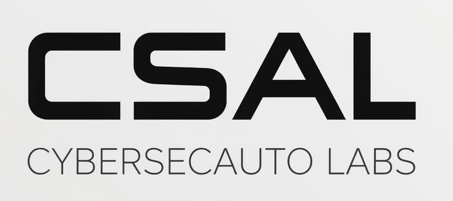

# CyberSecAuto Labs (CSAL)

**[CyberSecAuto Labs](https://cybersecauto-labs.org)** is an open-source initiative building cybersecurity automation and AI-assisted security tooling.

CSAL explores how automation and modern AI systems can improve security operations, vulnerability management, and defensive workflows.

---

## Projects

### [OpenVAS MCP Server](https://github.com/CyberSecAuto-Labs/OpenVAS-MCP)

> Self-hosted MCP server providing AI agents with structured access to OpenVAS / Greenbone.
>
> - No telemetry  
> - Credential isolation between clients and the scanner  
> - Raw scan data returned without transformation  
>
> A thin, auditable bridge. Analysis and reporting belong in the agent or in higher-level platforms.

### netaudit (coming soon)

> Network egress auditing for test execution.
> 
> Define allowed outbound connections, run your tests, and get a clear pass/fail report.
> 
> - Detect unintended external calls  
> - Prevent data exfiltration during execution  
> - Enforce network behavior policies in CI/CD  

### AiAVM (coming soon)

> AI Automated Vulnerability Management platform.
> 
> Orchestrates vulnerability scans, processes results, prioritizes risks, and generates actionable tickets and reports.
> 
> Focuses on the operational layer between vulnerability detection and remediation.

## Research Focus

- Security automation  
- Vulnerability management workflows  
- AI-assisted security operations  
- Scanner orchestration  
- Machine-readable security data pipelines  

## Philosophy

CSAL focuses on building practical security tooling that is:

- Self-hosted  
- Auditable  
- Easily integrated into modern security operations environments  

---

Maintained by security engineers exploring the future of automated cybersecurity operations.
